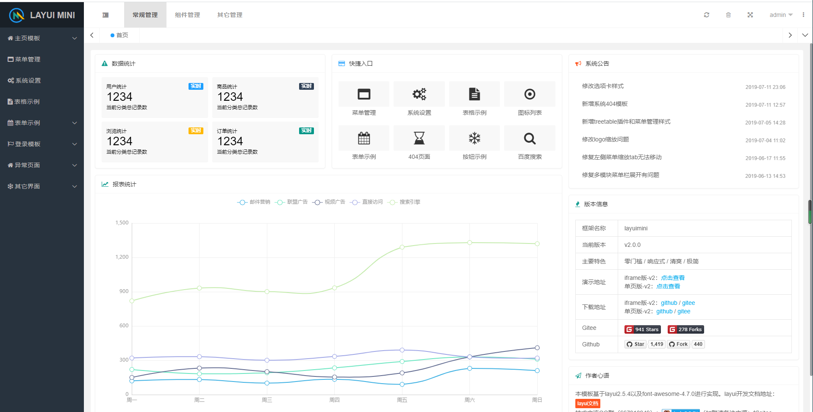

基于layuimini
===============
# 项目介绍
简洁、清爽、易用的layui后台框架模板。

# 主要特性
* 界面足够简洁清爽，响应式且适配手机端。
* 一个接口`几行代码而已`直接初始化整个框架，无需复杂操作。
* 页面支持多配色方案，可自行选择喜欢的配色。
* 支持多tab，可以打开多窗口。
* 支持无限级菜单和对font-awesome图标库的完美支持。
* 失效以及报错菜单无法直接打开，并给出弹出层提示`完美的线上用户体验`。
* url地址hash定位，可以清楚看到当前tab的地址信息。
* 刷新页面会保留当前的窗口，并且会定位当前窗口对应左侧菜单栏。
* 支持font-awesome图标选择插件

# 效果预览
> 总体预览

# 使用说明

layuimini使用文档地址：[查看文档](http://layuimini.99php.cn/docs/)

